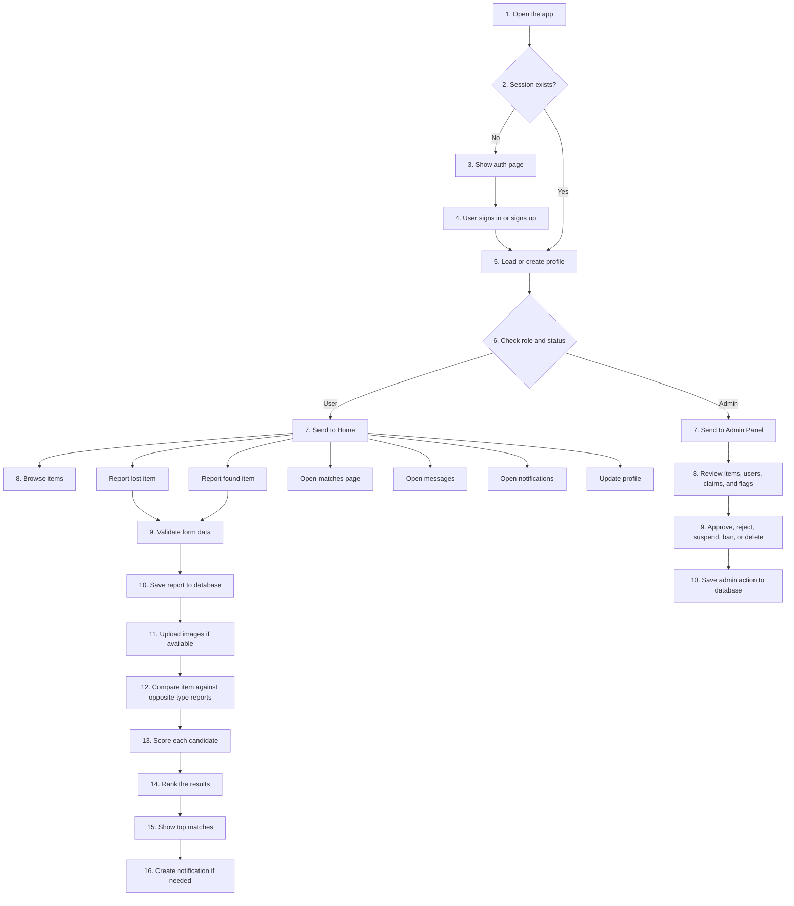
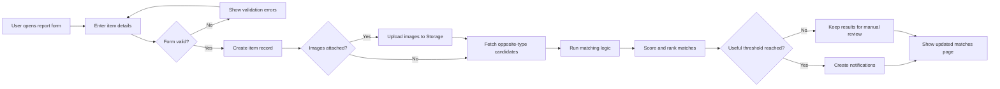
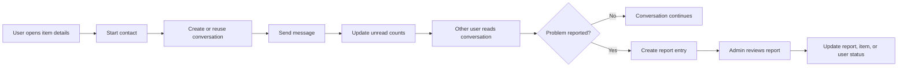

# PLP Lost and Found System Documentation

This document explains the system structure, the system flow, and the planned matching algorithm for the web app in a simple way.

## 1. Architectural Framework

### 1.1 High-Level Framework

```mermaid
flowchart LR
   User["👤 User"]
   InputDev["Input Devices<br/>(Keyboard, Camera)"]

   subgraph GroupA["Group A: Presentation & Routing"]
      UserModel["User Model<br/>(Profile, Preferences)"]
      AuthContext["Authentication Model<br/>(Session, Role)"]
      AppRouter["App Router<br/>(Route Decision)"]
   end

   subgraph GroupB["Group B: Processing & Services"]
      ProcessLayer["Data Processing Layer"]
      ServiceLayer["Service Layer<br/>(Auth, Items, Reporting,<br/>Matching, Admin)"]
      MessageLayer["Communication Layer<br/>(Messaging, Notifications)"]
   end

   subgraph GroupC["Group C: Backend Infrastructure"]
      SupabaseAuth["Supabase Auth"]
      SupabaseDB["Supabase Postgres"]
      SupabaseStorage["Supabase Storage"]
      ResetServer["Password Reset Server"]
   end

   Application["🔧 Application<br/>(React + Vite<br/>Frontend)"]
   OutputDev["Output Devices<br/>(Display, Notifications)"]

   User --> InputDev
   InputDev --> Application
   Application --> GroupA
   GroupA --> GroupB
   GroupB --> GroupC

   GroupC -.->|Data Response| GroupB
   GroupB -.->|Processed Data| GroupA
   GroupA -.->|Render State| Application
   Application --> OutputDev
   OutputDev --> User
```



### What this means

- The flow starts in the browser and moves through authentication first.
- `AuthContext` is the session checkpoint before any page is shown.
- `AppRouter` decides whether the user goes to auth, user pages, or the admin panel.
- `MainLayout` is the wrapper for the regular user screens.
- Pages call service modules, and those services read or write to Supabase.
- Images go to Supabase Storage, while password resets use the reset server.
- The architecture can also be read in layers: interface, service logic, and backend platform.

## 2. SYSTEM FLOW

### 2.1 Main User and Admin Flow



### 2.2 Report Submission and Matching Flow



### 2.3 Messaging and Moderation Flow



### System flow in plain language

1. The user opens the app.
2. The app checks whether a valid session already exists.
3. If there is no session, the auth page is shown.
4. The user signs in or creates an account.
5. The system loads the profile and checks role plus account status.
6. Admin users go to the admin panel and regular users go to the home page.
7. Regular users browse items, report lost items, report found items, message other users, and check notifications.
8. When a report is submitted, the app validates the form, saves the record, uploads images, and compares the report with opposite-type items.
9. The system ranks the best matches, shows them on the matches page, and sends notifications when needed.
10. Admin users review items, claims, and flags, then save their moderation actions back to the database.

## 3. Planned Algorithm

The main planned algorithm for this app is the item matching and alert pipeline.

### Matching Algorithm Overview

**Input:** a new lost report or found report

**Output:** ranked candidate matches, confidence label, and optional notification

### Step-by-step logic

```text
1. Validate the submitted form.
   - Make sure required fields are filled in.
   - Check that uploaded files are valid images.

2. Save the new report.
   - Insert the report into the items table.
   - Set the initial status to open.

3. Upload and attach images.
   - Store image files in Supabase Storage.
   - Save image metadata in the item_images table.

4. Fetch candidate items.
   - If the new report is lost, compare it with found items.
   - If the new report is found, compare it with lost items.

5. Score each candidate.
   - Compare item name similarity.
   - Compare category and custom category.
   - Compare description and identifiers.
   - Compare location.
   - Compare date proximity.
   - Compare image clues when available.

6. Calculate the final score.
   - Combine the individual scores using weighted values.
   - Convert the result into a confidence label such as Strong Match, Possible Match, or Weak Match.

7. Rank the candidates.
   - Sort from highest score to lowest score.
   - Keep only the top results for display.

8. Save or surface the results.
   - Store the top matches if needed.
   - Show them in the Matches page.
   - Create a notification when the score passes a useful threshold.

9. Support admin review.
   - Let admins confirm, reject, or close suspicious matches.
   - Update item and claim status after moderation.
```

### Scoring model

The current app design uses a weighted score made from multiple signals.

| Signal                    | Purpose                                 | Typical weight |
| ------------------------- | --------------------------------------- | -------------- |
| Item name                 | Checks if the names are similar         | High           |
| Category                  | Checks if the item type matches         | High           |
| Description / identifiers | Checks detailed clues                   | Medium to high |
| Location                  | Checks where the item was lost or found | Medium         |
| Date                      | Checks how close the report dates are   | Medium         |
| Image clues               | Checks visual hints when images exist   | Medium         |

### Simple pseudo formula

```text
final_score =
  (text_similarity * text_weight) +
  (metadata_similarity * metadata_weight) +
  (image_similarity * image_weight) +
  (time_location_similarity * time_location_weight)
```

### Confidence labels

- High score means the system highlights the match more strongly.
- Medium score means the item is worth checking manually.
- Low score means the item is kept as a weak suggestion only.

## 4. Key Modules In The App

| Module                           | Role                                                   |
| -------------------------------- | ------------------------------------------------------ |
| `AuthContext`                    | Tracks session, profile, and authentication state      |
| `AppRouter`                      | Controls page routing and access rules                 |
| `MainLayout`                     | Wraps user pages with navigation and theme behavior    |
| `authService`                    | Handles sign in, sign up, sign out, and password reset |
| `itemsService`                   | Loads and filters reported items                       |
| `reportingService`               | Creates reports and runs the match workflow            |
| `matching.js`                    | Computes similarity scores and confidence labels       |
| `adminService`                   | Loads and updates admin dashboard data                 |
| `messagingStore` / notifications | Handles user communication and alerts                  |

## 5. Short Summary

The app follows a simple pattern: authenticate the user, route them to the correct dashboard, save reports to Supabase, match items with scoring logic, and notify users or admins when action is needed.
